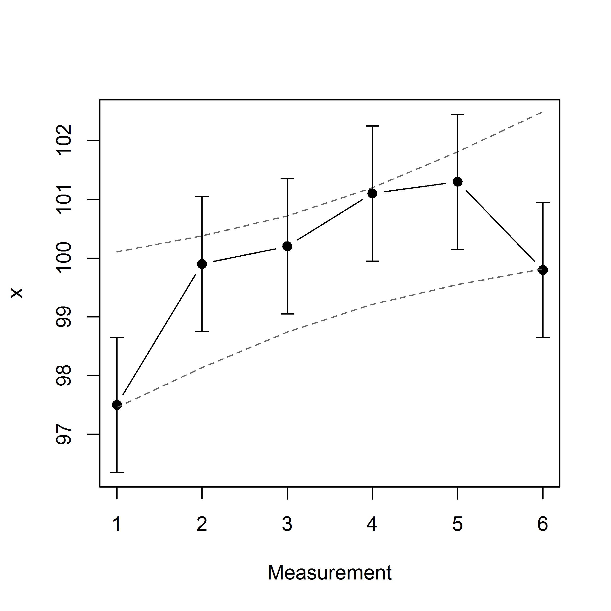
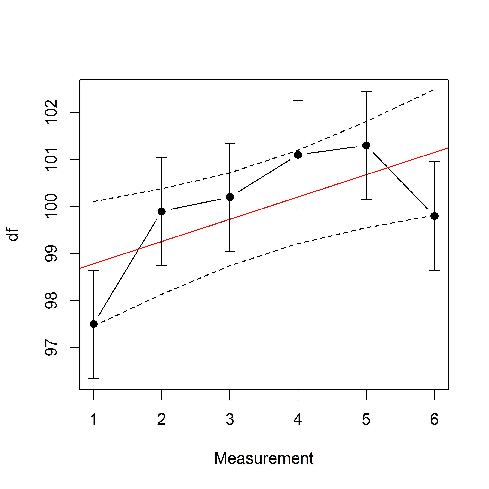

This vignette is intended to demonstrate the basic usage of `mbir` (**M**agnitude-**B**ased **I**nferences via **R**).

## Inspiration
Before we begin, users must be aware that `mbir` was originally inspired by the work of Will Hopkins^[Hopkins WG. sportsci.org.], and intended to inaugurate his work to the **R** community. Therefore, to give credit where credit is due, this vignette will formally declare which segments of `mbir` were directly derived from Hopkins.   

Also, the purpose of `mbir` is to provide practitioners, and researchers, a wholesale approach for deriving magnitude-based inferences from raw data. That is, in lieu of relying on practitioners to determine correct stepwise procedures independently, `mbir` programmatically detects appropriate statistical test(s) to run per the given data. This utility may serve as an educational tool to some (or perhaps alleviate doubt), but most importantly, will deliver a consistent platform for **R** users who aspire to employ this type of analysis. Respective functionalities will be dissected in later sections. 

## Overview
**Section 1: Data Functions**   
To start, `mbir` is currently equipped to analyze independent or paired, two-sample data. (Subsequent versions are planned to broaden the package's utility). Functions that end in "`_test`" are meant to accept raw data and perform statistical tests. The following functions are to investigate difference in means and associations, respectively:


- `smd_test()`
- `corr_test()`

**Section 2: Input Functions**   
On the contrary, functions listed below are structured to compute magnitude-based inferences for users who may have already performed statistical tests on their own:


- `smd()`
- `corr()`
- `odds()`

The additional functions below allows users to apply magnitude-based thinking when analyzing two proportions and two correlations, respectively:   

- `prop()`
- `corr_diff()`

**Section 3: Sample Size Functions**   
To appease the research-minded practitioners, functions that start with "`ss_`" assist with the critical decision of *a priori* sample size planning that correspond to the three input functions listed above:

- `ss_smd()`
- `ss_corr()`
- `ss_odds()`

For users who may prefer Accuracy in Parameter Estimation (AIPE) - the closely akin methodology to sample size planning via precision - can be employed with the below function:

- `aipe_smd()`

**Section 4: Miscellaneous Functions**   
If perhaps users are not familiar with a given effect size measure, `es_convert()` provides the service of converting between equivalent effect size measures. 

If users wish to calculate confidence intervals via resampling, `boot_test()` is a convenient function for this task. 

Lastly, `swc_ind()` assesses longitudinal change of an individual's performance measurements in a linear fashion.


## Section 1: Data Functions
`mbir` Data Functions are designed to accept raw data and execute appropriate statistical test(s) programmatically. The thematic operation of `mbir` Data Functions follow the statistical progression of:    

1. Assess Assumptions   
2. Perform Null-Hypothesis Statistical Test(s)   
3. Calculate Effect Size(s)   
4. Compute Magnitude-Based Inferences   

Each of these steps are obligatory for proper statistical estimations of effect, which was a major incentive for the creation of `mbir`.  Let's now examine the underlying mechanisms and implementation of `mbir` Data Functions.

### 1.1. `smd_test()`
The objective of `smd_test()` is to express difference in means between two continuous data vectors (standardized mean difference). The study design may be independent group differences or paired group differences (e.g. pre-post analysis). As the overarching goal of `mbir` is to provide an automated sequence of statistical decisions, `smd_test()` descends raw data down the correct path(s) illustrated in Figure 1 and described below:

```{r, out.width = "690px",echo=FALSE, fig.align='center',fig.cap="Figure 1: decision tree illustration"} 
knitr::include_graphics("figures/twosample.jpg")
```

**1) Explore Assumptions:** In order to perform parametric tests, data must fit parametric assumptions, otherwise the results are likely improper. To start, parametric tests assume a Gaussian (normal) distribution. Rather than visually inspecting normality via histograms or Q-Q plots, quantifying the shape of the distribution allows for objective decision-making. `smd_test()` employs the Shapiro-Wilk test to check whether the distribution deviates from a comparably normal shape (i.e. compares the scores in the sample to a normally distributed set of scores with the same mean and standard deviation). If the test is non-significant (*p* < 0.05) informs us that the sample is not significantly different from normal, indicating the assumption is observed. In this case, `smd_test()` answers "Yes" to the normality assumption and descends left in Figure 1. The next required assumption is homogeneity of variance (equal variance between vectors). This step is quantified via the *F*-test to examine the ratio of the two variances. As with the Shapiro-Wilk test, non-significance informs us that homogeneity is assumed, and again, answers "Yes" in the decision tree (Figure 1) which ultimately dictates which *t*-test performed (will be discussed soon).   

Before moving on however, if perhaps the data is non-normal, this suggests applying a transformation to counteract the present skewness. Skewness is problematic for *t*-tests as they are entirely focused on the mean (which is strongly affected by outliers). Unfortunately, deciding whether to remain parametric versus nonparametric is difficult to justify numerically, so `smd_test()` provides both. On the parametric side, log-transformation is a common technique to correct for positive skewness, and is especially common amongst the sport community.^[Hopkins WG, Marshall SW, Batterham AM & Hanin J. (2009). Progressive statistics for studies in sports medicine and exercise science. *Medicine & Science in Sports & Exercise*, 41, 3–13.] 

- Note: as there is no logarithm of the value zero, if zeros are detected amongst data vectors, a constant of 1 is added to original scores before transformation. The advantage of adding 1 is that the logarithm of 1 is actually equal to zero, so scores of zero before transformation conveniently return to zeros after transformation. 

The nonparametric alternative is to rank-transform (i.e. lowest score is given rank 1, next highest score rank 2, etc), which permits less restrictive distributional assumptions than it's parametric counterpart. The analysis is then carried out on the ranks in lieu of the raw data, which is an ingenious maneuver around the parametric assumptions.   

**2) Null-Hypothesis Statistical Testing:** Once the assumptions and/or transformations are accounted for, the succeeding step is to perform the determined hypothesis test. On the parametric side (after considering normality) the homoscedastic assumption dictates the type of *t*-test applied. To quickly substantiate, if the two variances are equal there is only one source of uncertainty to account for as the standardizer (developed by WS Gosset "Student"), whereas there are two sources of uncertainty to account for if variances are unequal (BL Welch method). On the nonparametric side, the Wilcoxon derivatives (sign-rank, paired design; rank-sum, independent design) are the nonparametric, rank-transformed equivalent to the *t*-tests. 

**3) Effect Size:** Upon acquiring NHST parameters, the job is not done. Dogmatic *p*-values fail to express the level of impact, or magnitude, of effect - as this parameter is confounded on both *n* and observed effect,^[Lang JM, Rothman KJ, & Cann CI. (1998). That confounded *P*-value. *Epidemiology*, 9, 7-8.] leading to deceitful interpretations. Rather, a popular solution to this critism is to standardize the magnitude of effect, known as *effect size*, and thus serves as a foundation of `mbir` to supplement the determination of effects under consideration. Numerous effect size measures exist, but the most common are Cohen's *d*, Pearson's *r* and odds ratios, and are one of the final steps of `smd_test()` to programmatically calculate from the corresponding NHST parameters. 

In a nutshell, when a Gaussian distribution is detected, the terminal effect size is Cohen's *d*, which is purely the effect size in original units divided by the appropriate standard deviation (which `mbir` automatically detects). Therefore, Cohen's *d* can be interpreted as untis of standard deviations, and is sometimes called *standardized mean difference*, hence the "smd" acronym. 

- Unfortunately, *d* overestimates size of effects with small sample sizes. Consequently, to reduce bias and avoid overestimating *d*, an approximate adjustment factor is applied to *d* when degrees of freedom are below 30.^[Hedges LV. (1981). Distribution theory for Glass’s estimator of effect size and related estimators. *Journal of Educational Statistics*, 6, 107–128] Thereafter, *d*~adj~ represents the adjusted effect size value. 

Upon log-transformation, exponentiating the confidence intervals of the log-transformed difference consequently bestows a difference in geometric means.^[Altman DG. (1991). *Practical statistics for medical research*. London, UK: Chapman and Hall] Subsequently taking the difference between these two values captures the point estimate - that is, on the log scale: log(a)-log(b) = log(a/b), which can be interpreted in a similar manner as an odds ratio. On the nonparametric side, dividing the *z* value by the square root of *n* stealthily arrives at *r*. 

- Effect size confidence intervals are provided for each analysis to disclose the precision of observed effect size, or perhaps the maximum likely estimation error.   

**4) Magnitude-Based Inferences:**   

The final calculations aggregate the aforementioned statistical parameters to ultimately formulate magnitude-based inferences of effects. Calculations were reverse-engineered from Hopkins's cited spreadsheet^[Hopkins WG. (2007). A spreadsheet for deriving a confidence interval, mechanistic inference and clinical inference from a *p* value. *Sportscience* 11, 16-20. sportsci.org/2007/wghinf.htm.] and transcribed into the **R** language. Users are welcome to use `mbir` Input Functions (Section 2) to directly compare their numerical results to the respective spreadsheet and thereby confirm `mbir` calculations are correct. 

To quickly abbreviate, magnitude-based inferences offer a form of inference in which the parameter is partitioned into three regions corresponding to various qualitative aspects (substantially negative, trivial, substantially positive). A probability is assigned to each of these regions, calculated from the assumed distribution of the parameter estimate. To be more transparent, the obtained *t* statistic is adjusted (updated) by the calculated effect size before justifying the cumulative probability distribution. (This marvelous statistical modulation has therefore been coined "pseudo-Bayesian"). Each `mbir` function presents the observed magnitude of effect, as well as the precision of estimation. *P*-values are shown for the sake of formality, but users are encouraged to highlight Hopkins' content-rich inference: making a qualitative statement with regard to practical significance. The last line of `smd_test()` output composes the appropriate statement from given parameters, which considers both the level of confidence (*possibly*, *likely*, etc), level of magnitude (trivial, small, moderate, etc), as well as the direction (negative, positive) of effect.

Unfortunately magnitude-based inferences has been formerly criticized for inflated probabilities of effect (lacking conservativeness).^[Welsh AH & Knight EJ. (2015). "Magnitude-based inference": A statistical review. *Medicine & Science in Sports & Exercise*, 47, 874-884.] ^,^ ^[Barker RJ & Schofield MR. (2008). Inference about magnitudes of effects. *International Journal of Sports Physiology and Performance*, 3, 547-557.] To counter this notion however, if an intervention is able to reproduce a *possibly small* improvement in elite performance, it is therefore an arguably worthwhile and meaningful intervention (that may have passed under the statistical radar of more conservative approaches).

**Example 1 **   
Consider the following data set, which sampled twenty wide receiver 40-yard dash times from both 2007 and 2017 NFL combine.^[nflcombineresults.com]

```{r, echo=FALSE}
then<-c(4.51, 4.46, 4.36, 4.57, 4.50, 4.49, 4.30, 4.57, 4.44, 4.67, 4.48, 4.32, 4.45, 4.52, 4.35, 4.50, 4.54, 4.52, 4.39, 4.54)
now<-c(4.54, 4.68, 4.70, 4.41, 4.47, 4.45, 4.45, 4.44, 4.52, 4.57, 4.49, 4.61, 4.50, 4.50, 4.53, 4.64, 4.46, 4.56, 4.53, 4.58)
```

```{r,echo=FALSE,fig.width=5,fig.align='center'}
graphics::par(mfrow=c(1,2))
graphics::hist(then, col='gray', border='white', las=1, xlab = "2007", main = " ")
graphics::hist(now, col='gray', border='white', las=1, xlab = "2017", main = " ",ylab = " ")
```

If a practioner wanted to decipher if the prospective athletes recorded faster times in 2017 versus 2007, `smd_test()` would follow the below syntax:

- `x` as the group of interest (2017).
- `y` as the null group to test against (2007). 
- `paired = FALSE` due to the independent study design. 

```{r}
mbir::smd_test(x = now, y = then, paired = FALSE, auto = T)
```

`smd_test()` output first provides the mean for the respective groups, followed by the detected assumptions and statistical test performed. Since normality and homoscedasticity were observed, the Student's *t*-test was executed upon the raw data (which can be confirmed by following the decision tree path in Figure 1). After displaying the *t*-test parameters, we see Cohen's *d* of 0.66 (± 0.54) attributes to a *moderate* effect size magnitude (according to Hopkins' thresholds). However, applying the qualitative language associated with the magnitude-based inferences (last line of `smd_test()` output), we can add *possibly* to our conclusion statement. 

Since the effect size unit ended up positive, this infers that 2017 times were actually slower than 2007 (an increase in time). Therefore, the concluding statement to the above scenario would be something to the effect of:

>"Wide receivers from the 2017 NFL combine recorded slower 40-yard dash times than wide receivers from the 2007 NFL combine by a *possibly moderate degree* (*d* = 0.66 ± 0.54)."

**Example 2**

Consider this fictional data set of pre-test post-test pull up values. Notice the large positive skewness, as the majority of pre-test values reside between 0-4 with a handful of outliers who record more than 6 pull ups. 

```{r,echo=FALSE}
pre<-c(2, 1, 1, 4, 1, 1, 9, 1, 2, 2, 2, 3, 3, 2, 1, 1, 1, 1, 2, 1, 2, 1, 1, 3, 1)
post<-c(2, 4, 2, 1, 3, 4, 7, 2, 2, 2, 7, 2, 1, 1, 7, 1, 2, 2, 3, 2, 2, 2, 6, 9, 1)
```

```{r,echo=FALSE,fig.width=5,fig.align='center'}
graphics::par(mfrow=c(1,2))
graphics::hist(pre, col='gray', border='white', las=1, xlab = "Pre-Test", main = " ")
graphics::hist(post, col='gray', border='white', las=1, xlab = "Post-Test", main = " ",ylab = " ")
```

If a practitioner wanted to ask if there was a positive effect after some training intervention, `smd_test()` would be used in the following manner:

- `x` post-test
- `y` pre-test
- `paired = TRUE`

```{r}
# Named a variable "mag" for later use within vignette
mag<-mbir::smd_test(post, pre, paired = T, auto = T)
```

Since the raw data deviated far from a Gaussian distribution, transformations were applied to correct for such violation. Regarding the parametric inference, quite significant NHST parameters are calcualted. However, what is more telling is that post-test values recorded 1.53 (± 0.45) times more pull ups than pre-test, resulting in a *most likely small* increase. Before moving on though, let's consider the philosophy behind Frank Wilcoxon's underutilized, yet elegant, nonparametric methodology - as it may provide better context for answering the present question. 

The Wilcoxon signed-rank test operates in a fairly similar manner as the paired *t*-test (based on the difference between two conditions). Once these differences between pre-/post-test are calcualted they are numerically ranked with the sign of the difference (positive/negative) assigned to each rank (zeros excluded). In the end, the sum of the positive ranks are tested against the sum of the negative ranks. Thinking back to the pull up scenario, this logic dovetails nicely with the question at hand: how many athletes improved, performed equal, or worse from pre-test to post-test? The nonparametric analysis indeed appreciates that a select few experienced a performance decay (*r* 90% lower bound: -0.06) while most reaped a positive adaptation (*r* 90% upper bound: 0.57). Therefore, the present conclusion would take on the following argot:

>"After 4-week training intervention, athletes exhibited a *likely small* increase in pull up performance (*r* = 0.28 ± 0.32)." 

### 1.2. `corr_test()`
The objective of `corr_test()` is to express associations between two continuous data vectors. Paralleling `swd_test()`, `cor_test()` accepts raw data and provides an automated sequence of statistical decisions. The statistical progression for correlation is far more superficial compared to difference of means. The major assumption of Pearson correlation is that the data follows a bivariate Gaussian disribution. If the given data set deviates from said distribution, Spearman's rank correlation is implemented instead (association of rank-transformed data). Spearman's standardized unit of measurement is ρ (rho), but is interpreted the same as the linear *r*. Simply supplying two data vectors to `corr_test()` (`x`, `y`) delivers an output analogous to `smd_test()`.

## Section 2: Input Functions
The first three functions are intended to emulate the experience of Hopkins' Microsoft Excel spreadsheet^[Hopkins WG. (2007). A spreadsheet for deriving a confidence interval, mechanistic inference and clinical inference from a *p* value. *Sportscience* 11, 16-20. sportsci.org/2007/wghinf.htm.] within the **R** environment. However, if users are not comfortable with performing proper statistical tests and inputing the parameters independently, they are gladly prompted to use `mbir` Data Functions in Section 1. The following two functions are supplemental statistical Input Functions.

### 2.1. `smd()`

The syntactic structure of `smd()` requires the following *t*-test parameters:

- effect size measure (Cohen's *d*)
- *p*-value
- degrees of freedom

```{r}
mbir::smd(es = 0.7, p = 0.02, df = 24)
```

### 2.2. `corr()`

The syntactic structure of `corr()` requires the following correlation parameters:

- *r*
- *n*

```{r}
mbir::corr(r = 0.22, n = 30)
```

### 2.3. `odds()`

The syntactic structure of `odds()` requires the following test parameters:

- odds ratio
- *p*-value

```{r}
mbir::odds(or = 3.25, p = 0.06)
```

### 2.4. `prop()`

A moderately common research question asks about the relation, or difference, between two nominal variables, producing a 2x2 data set called a *frequency table*. The approach in answering questions about such a table is to calcualte the difference between two proportions. 

The syntactic structure of `prop()` simply requires the proportions and sample sizes of each group under consideration:

```{r,eval=FALSE}
mbir::prop(p1, n1, p2, n2)
```

For a brief example, consider this fictitious plot: 

Imagine there were two teams that recorded the same number of minor overuse injuries during the off-season, say 10 athletes. However, someone recognized that the roster size for Team 1 was 19, whereas the roster size for Team 2 was 26 - that is, on a relative scale, over half of Team 1 accrued an overuse injury (10/19 = 53%) versus only 38% of Team 2 (10/26). Upon immediate realization, 53% was perceived as substantially higher than 38%, causing some people to question whether the coach of Team 1 should be castigated. However, before jumping to rash conclusions, this person first utilized `prop()` to help construct the proper locution. Let's peer inside the results of the given scenerio:

```{r}
mbir::prop(p1 = 0.53, n1 = 19, p2 = 0.38, n2 = 26)
```

It appears that coach of Team 1 lucked out! There was an *unclear* differentiation between the two relative measures (also, notice how zero resides between the confidence intervals). However, this was a close call considering that Φ is beyond the *small* threshold. Perhaps with a slightly larger *n* magnitude-based inferences would have quantified a *possible* effect.

- *Note: since χ2 distribution is positive, magnitude-based inferences must surpass possibly substantial threshold in order to detect effects. Also, trivial effects must not transcend unlikely threshold.*

### 2.5. `corr_diff()`

Upon testing correlations via `corr_test()` or `corr()`, users may want to decipher a post hoc difference between two acquired correlations. The syntactic structure of `corr_diff()` requires the following test parameters:

```{r,eval=FALSE}
mbir::corr_diff(r1, n1, r2, n2)
```

For a brief example, consider this fictitious plot:

Suppose a practitioner used `corr_test()` twice to derive correlations between subjective body image satisfaction scores and overall well-being for both female and male athletes. The female group exhibited a *most likely large* positive association of *r* = 0.53 (*n* = 25), while the male group revealed a *most likely moderate* positive association of *r* = 0.41 (*n* = 38). However, if the ultimate question was whether body satisfaction is more essential to well-being for females than males, the practitioner needs to test the confidence interval on the difference:

```{r, eval=FALSE}
# Female correlation test
female<-mbir::corr_test(Female$bodyimage, Female$wellbeing)

# Male correlation test
male<-mbir::corr_test(Male$bodyimage, Male$wellbeing)

# Test of Two Correlations
mbir::corr_diff(r1 = male$r.stat, n1 = 38, r2 = female$r.stat, n2 = 30)
```

```{r,echo=FALSE}
mbir::corr_diff(r1 = 0.41, n1 = 38, r2 = 0.53, n2 = 30)
```

Even though the two correlations display strong evidence towards their associations independently, the practitioner cannot conclude that one of the groups has a stronger relationship compared to the other (i.e. the two positive correlations do not differ). In the end, the conclusion would be there is considerable uncertainty between groups, as the difference in correlations for females and males (*r*~*2*~ - *r*~*1*~ = 0.12) could plausibly be as low as -0.28 or as high as 0.57. 

## Section 3: Sample Size Functions
Now let's turn to the central planning issue of determining *n*. It is safe to say that a primary objective of fundamental statistics is to minimize the error (or maximize precision) of estimation, and since sample size resides in the denominator of the standard error, increasing sample size inherently decreases standard error. However, in terms of time, resources, and funding, researchers must establish a *n* that will give the most bang for their buck - that is, the minimum sample size that will uncover a meaningful effect. 

The traditional NHST approach for sample size determination is power analysis, which means that power bears all the NHST limitations. Therefore, if practitioners wish to use magnitude-based inferences for analysis, it is wise to declare prospective sample sizes within the magnitude-base framework. The first three `mbir` Sample Size Functions are based upon Hopkins' speadsheet for sample size estimation,^[Hopkins WG. (2006). Estimating sample size for magnitude-based inferences. *Sportscience* 10, 63-70. sportsci.org/2006/wghss.htm] which require users to input desired *n* and desired effect size to estimate the magnitude-based inferences from the given parameters. However, this approach may take some time with numerous iterations to acheive sought-after parameters. 

Alternatively, a swifter tactic is to calculate *n* algebraically from a desired margin of error. This technique is called Accuracy in Parameter Estimation (AIPE),^[Maxwell SE, Kelley K & Rausch JR. (2008). Sample size planning for statistical power and accuracy in parameter estimation. *Annual Review of Psychology*, 59, 537-563.] ^,^ ^[Kelley K & Rausch JR. (2006). Sample size planning for the standardized mean difference: Accuracy in parameter estimation via narrow confidence intervals. *Psychological Methods*, 11, 363–385.] which is based on the notion of maximizing precision of estimates for the standardized mean difference. AIPE can be employed with `aipe_smd()` and will be discussed in further detail below.

### 3.1. `ss_smd()`

The syntactic structure of `ss_smd()` requires the following parameters:

- `exp` desired size of experimental group
- `con` desired size of control group
- `es` desired effect size (Cohen's *d*)

```{r}
mbir::ss_smd(exp = 20, con = 18, es = 0.6)
```


### 3.2. `ss_corr()`

The syntactic structure of `ss_corr()` requires the following parameters:

- `n` desired number of data pairs
- `r` desired correlation coefficient

```{r}
mbir::ss_corr(n = 25, r = 0.25)
```

### 3.3. `ss_odds()`

The syntactic structure of `ss_odds()` requires the following parameters:

- `exp` desired size of experimental group
- `con` desired size of control group
- `odds` desired odds ratio

```{r}
mbir::ss_odds(exp = 12, con = 16, or = 2.5)
```

### 3.4. `aipe_smd()`
As mentioned above, AIPE in centered around the idea of precision. How wide could a confidence interval be while still providing useful information? What is the maximum error of estimation we are willing to accept? These are the forms of questions that can be answered via AIPE. The unit of error estimation for AIPE is the margin of error (MOE), expressed in standard deviation units, *f*. Luckily, Cohen's *d* is also interpreted as a fraction of standard deviations. Therefore, when working with `aipe_smd()`, feel free to think of MOE synonymous with Cohen's *d*.

Suppose a team of investigators establish an independent study design with the desired precision of *f* = 0.5 at the 90% confidence level. (That is, with a 90% CI they are willing to accept a Cohen's *d* of ± 0.5). Let's examine how this team would implement `aipe_smd()`:

- `moe` 0.5 target margin of error
- `paired = F` independent design
- `conf.int` (optional) defaults to 90%

```{r}
mbir::aipe_smd(moe = .5, paired = F)
```

The output demonstrates that in order to achieve MOE no more than 0.5 the team needs *at least 24 subjects in each group*. Taking this one step further, if the team wanted to know what percent of experiments would produce a MOE smaller than their target MOE, they would refer to the second given sample size regarding *assurance*. (Assurance calculates *n* based upon how many experiments would yield more precision than the target MOE in the long-run). To interpret the present scenario, 99 out of 100 experiments with *n* = 34 per group would provide more precision than 0.5.

- `aipe_smd()` defaults to 99% assurance, but users are welcome to adjust with `assur.lvl` arugment.

Shifting to the paired design, the only additional argument is to provide the correlation between the two measures. At first, pre-test post-test correlations may seem a bit tricky to project, however, referring to prior literature gives good orientation of what previous researchers have observed. *r* is also quite influential in AIPE calculations, so please be mindful when establishing *r*. 

An example paired design would therefore follow the structure of:

```{r}
mbir::aipe_smd(moe = .5, paired = T, r = .65)
```

Due to the underlying sensitivity paired designs present, notice the considerable reduction in sample size required to obtain equal precision. 

## Section 4: Miscellaneous Functions
### 4.1. `es_convert()`
If perhaps users are not familiar with a given effect size measure from say, `smd_test()`, they are encouraged to convert between equivalent effect size unit of choice. `es_convert()` provides the service of converting between Cohen's *d*, *r*, and odds ratio.^[Rosenthal R. (1994). Parametric measures of effect size. In H. Cooper & LV. Hedges (Eds.), *The Handbook of Research Synthesis*. New York, NY: Sage.] ^,^ ^[Borenstein M, Hedges LV, Higgins JPT & Rothstein HR. (2009). *Introduction to Meta-Analysis*. Chichester, West Sussex, UK: Wiley.] 

**Example**

The syntactic structure of `es_convert()` is of the form:

```{r,eval=FALSE}
mbir::es_convert(x, from = c("d", "or", "r"), to = c("d", "or", "r"))
```

Simply entering the final effect size measure (say, a pearson *r* of 0.20), declaring the current unit (`from = "r"`), and stating what unit to convert to (`to = "or"`) delivers:

```{r}
mbir::es_convert(0.2, from = "r", to = "or")
```

If users wish to include effect size confidence intervals from preceding `smd_test()` results within one line of code, they may do so as such:

```{r, eval=FALSE}
# Section 1.1. pre-test post-test 40 yard dash example:
mag<-mbir::smd_test(post, pre, paired = T, auto = T)
```


```{r}
# Wish to convert given Odds Ratio to Cohen's d:
mbir::es_convert(c(mag$or.LL, mag$or.stat, mag$or.UL), from = "or", to = "d")
```


### 4.2 `boot_test()`
Perhaps a given data set does not follow a Gaussian distribution, or even after log-transformation there are still major outliers present. If this is the case, bootstrapping is an attractive alternative for deriving nonparametric confidence intervals via resampling, as it does not assume a distribution. The simple, yet exquisite, bootstrap procedure is as follows:

**1)** Sample *n* observations (with replacement) from each independent data vector.

**2)** Compute the statistic of interest from each "bootstrapped" sample (`mbir` calculates the median to ensure a robust estimation of central tendency).

**3)** Calculate and record the difference in medians between the two "bootstrapped" samples.

**4)** Repeat the above steps a large number of times to obtain a list of difference in medians (`mbir` defaults to 10,000 repetitions).

**5)** Finally, the bootstrap confidence interval is simply the interval that contains the lower and upper bound of the observed difference in medians. `mbir` defaults to 90% confidence interval, so in this case, the 5th and 95th percentile of this final vector is the 90% bootstrap confidence interval.

- The method described above is called *percentile-based resampling confidence interval*. Subsequent versions may entail other bootstrap derivatives upon user requests.

**Example**

Consider a data set representing sRPE scores from both "low" and "high" days, respectively. Let's say a user wants to determine if they can definitively say that their athlete's "high" sessions are being perceived higher than the "low" sessions. After noticing the apparent skewness presented in "low" data set, the user could use `boot_test()` as a hasty resource to evade any distributional assumptions (`smd_test()` would also be appropriate, of course, but `boot_test()` will be used for sake of example).  

```{r, echo=FALSE}
high<-c(600,450,420,375,480,360,200,510,420,360,165,150,300,250,480,260,510,400,455,300,540,250,450,490,140,480,950,880,709,730,300)
low<-c(276,250,330,322,250,900,300,160,350,250,432,300,150,160,220,180,343,328,414,231,224,280,315,175,231,420,486,180,200,160,1440)
```

```{r,echo=FALSE,fig.width=5,fig.align='center'}
graphics::par(mfrow=c(1,2))
graphics::hist(low, col='gray', border='white', las=1, xlab = "Low Sessions", main = " ")
graphics::hist(high, col='gray', border='white', las=1, xlab = "High Sessions", main = " ",ylab = " ")
```


The syntactic structure of `boot_test()` is of the form:

```{r,eval=FALSE}
mbir::boot_test(x, y, conf.int, resample, med)
```

The only required arguments are to provide two numeric data vectors for `x` and `y`. Beyond this, specified confidence intervals may be supplied (default is 90%), number of resampling repititions (defaults to 10,000), as well as a specified true median to test against (defaults to 0).

In our example, the user specifically wants to test whether "high" sessions are at least 100 units above "low" sessions in order to definitively say there is a difference. Therefore, `boot_test()` would be used in the following manner:

```{r, fig.align='center'}
mbir::boot_test(high, low, med = 100)
```

The histogram illustrates the bootstrapped distribution of the resampled difference in medians. If the dashed line (`med`) is within the solid lines (confidence intervals), evidence of effect is absent. Conversely, if `med` is outside the confidence intervals, evidence of effect is present. 

Regarding the sRPE data set, surely an effect is present, but unfortunately the user can not definitively say there is a difference of 100 after resampling, as the 90% confidence interval contains 100 (dashed line between solid lines).

### 4.3 `swc_ind()`
Applying magnitude-based inferences to the longitudinal trend of an athlete's performance measurements can be implemented with `swc_ind()`. Two types of analyses can be explored with `swc_ind()`: magnitude of change from an individual's preceding measurement, and the degree of deviation from their overall trend.^[Hopkins WG. (2017). A spreadsheet for monitoring an individual's changes and trend. *Sportscience* 21, 5-9. sportsci.org/2017/wghtrend.htm]

Specifying "previous" under the `type` argument will execute the first type of analysis, illustrating magnitude-based inferences regarding the change between each time point. Simply supply raw measurement values in ascending chronological order (first measurement in row 1, most recent measurement in *nth* row) and `swc_ind()` will provide partitioned magnitude-based inferences accompanied with qualitative inferences of either increase or decrease from previous time point. The function also provides a visual demonstrating relative change, including vertical error bars (typical error) with each data value. Measurements are linearly connected to express the inherent repeated measure analysis, while underlaying the smallest worthwhile interval bands to supplement the visual trend. 

For "previous" analysis, the syntactic structure of `swc_ind()` involves the following parameters:

- `x` numeric data vector of an individual's performance measurements
- `swc` (±) smallest worthwhile change
- `type` "previous"
- `te` (optional) typical error of measurement

```{r,eval=FALSE}
df<-c(97.5,99.9,100.2,101.1,101.3,99.8)
mbir::swc_ind(x = df, swc = 0.25, type = "previous")
```

```{r, out.width = "350px",echo=FALSE, fig.align='center',fig.cap=" "} 

```

```{r,eval=FALSE}
## MBI From Previous Time Point:
##
##         Diff    N  T  P               MBI
## 1 - 2    2.4    8  4 88   Likely Increase
## 2 - 3    0.3   37 12 51               ---
## 3 - 4    0.9   26  9 65               ---
## 4 - 5    0.2   40 11 49               ---
## 5 - 6   -1.5   76  7 17               ---
```

Smallest worthwhile change argument requires users expertise regarding their particular data/athlete. With a lack of context, it would negligent to provide a default value for each situation. On the other hand, typical error defaults to the standard error of the linear regression residuals, but practitioners can certainly modify as needed. 

Regarding the output table, from left to right, first describes the raw difference from preceding time point in ascending chronololgical order, followed by the probabilistic magnitude-based inference relating to the direction of change ("N" negative, decrease; "T" trivial; "P" positive, increase). On the far right are the qualitative inferences if detected (dashed lines represent *unclear* change, otherwise specified). The current example displays a *likely increase* from measurement 1 to measurement 2. Otherwise, no meaningful change was detected beyond time point 2. 

Transitioning to the other offered analysis, "trend", permits user to assess linear trajectory of measurements, as well as the degree of which each measurement deviates from the line of best fit. When "trend" is specified, users will be granted information regarding traditional regression statistics comparing values to a null model (in case of literature pursuit), such as: β coefficient (slope), *R*^*2*^, *F*-ratio and *p*-value. However, to apply magnitude-based inferences towards the linear trend requires an additional argument to specify; an anticipated slope (±) to test against.

For "trend" analysis, the syntactic structure of `swc_ind()` involves the following parameters:

- `x` numeric data vector of an individual's performance measurements
- `swc` (±) smallest worthwhile change
- `type` "trend"
- `ts` (±) target slope

```{r,eval=FALSE}
mbir::swc_ind(x = df, swc = 0.25, ts = 0.2, type = "trend")
```

```{r, out.width = "350px",echo=FALSE, fig.align='center',fig.cap=" "} 

```


```{r,eval=FALSE}
##    Trend Parameters:               
## Slope     0.474
## R-squared 0.283
## F stat    2.973
## P value   0.160
##
##         Very Unlikely Unlikely  Likely    
##         "Decrease"    "Trivial" "Increase"
## MBI (%) "3"           "20"      "77"      
##
##    MBI From Trend Line:
##
##  Point   Diff    N  T  P                  MBI
##      1   -1.3   88  7  5         Likely Lower
##      2    0.6   26 12 62                  ---
##      3    0.5   30 13 57                  ---
##      4    0.9   21 11 68                  ---
##      5    0.6   26 13 61                  ---
##      6   -1.4   90  5  5    Very Likely Lower
```

Below the given Trend Parameters is the magnitude-based inference about the slope against the target slope. In the current example, the slope of 0.474 is *likely higher* than the specified 0.25. The last table describes magnitude-based inferences of how far each time point vertically deviates from regression line (essentially an analysis of residuals). The current example displays that the first measurement is *likely lower* than the trend line, as well as measurement 6 being *possibly lower*. Otherwise, no meaningful deviations were detected. 

**References**
